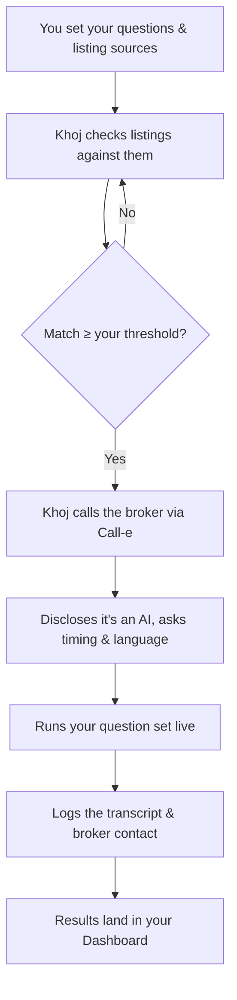

<<<<<<< HEAD
# Broker Callback — backend

A tenant-side voice agent that calls every broker on a shortlist, runs one short
script against all of them, and returns a ranked table of the listings that are
actually worth a Saturday.

This is the backend. It runs end-to-end **today**, with no telephony account and
no call credits, because the dialer is an interface with a mock implementation
that replays fixture transcripts through the real webhook route.

## Test it

Nothing below needs a telephony account. Only the last two need an API key.

```bash
npm install
cp .env.example .env
```

**1. Unit tests — instant, no key, no server.**

```bash
npm test
```

47 tests. 39 unit tests over phone normalisation, pasted-listing parsing, the IST calling windows, the
compliance assertion, script assembly, the evidence guard, verdict logic,
ranking and the run statistics; plus 8 integration tests that boot the real
Fastify app in-process against a throwaway database and exercise the calling-
window gate, the listings cap, the concurrency cap, pause-cancels-in-flight, and
restart recovery.

**2. Full pipeline — no key, no calls.**

```bash
npm start          # terminal 1
npm run demo       # terminal 2
```

Dials 12 fixture listings five at a time, streams the live event feed, and
prints the ranked table. Without an API key every call still completes and every
transcript still persists — only the extraction step fails, per call, without
taking the run down.

**3. Extraction — needs `ANTHROPIC_API_KEY` in `.env`.**

```bash
npm run replay     # re-extract every stored transcript, places no calls
npm run eval       # field-level accuracy against eval/goldens.json
```

`npm run replay` is the extraction dev loop: dial once with the mock, then
iterate on the prompt and the guard against the same transcripts as often as you
like. `npm run eval` prints exact/miss/wrong per field and exits non-zero below
the 90% gate.

## Testing in Postman

Import `postman/khoj.postman_collection.json`. It ships 13 requests with
assertions and auto-captures `runId` and `callId` as you go, so you can run it
top to bottom.

Start the server in **manual** mode first:

```bash
DIALER=manual RETRY_DELAY_MIN=1 npm start
```

`DIALER=manual` places each call and then waits — the call parks in `dialing`
until *you* deliver the result. The normal mock dialer completes a call in
milliseconds, so there is never a moment where a webhook can be sent by hand.
On Windows PowerShell: `$env:DIALER='manual'; npm start`.

Then, in Postman:

1. **Health** — confirms which dialer is live.
2. **Parse pasted listings** — paste a messy WhatsApp-style block; get back
   dialable numbers with the landline, the rents and the date filtered out.
   Feed the `listings` array straight into the next request.
3. **Create run** — four numbers written four different ways; all should
   normalise to E.164.
4. **Get run** — the ranked table. Captures a `callId`.
5. **Webhook · answered call** — this is exactly what CALL-E will POST. Fire it
   and the parked call completes with a transcript.
6. **Webhook · duplicate** — send it straight after. Providers retry; a second
   delivery must not overwrite the transcript or spend another Claude call.
   Expect `result: "duplicate"`.
7. **Webhook · bad signature** — expect 401.
8. **Validation · bad phone** — expect 400 naming listing 2. The whole run is
   rejected rather than silently dropping a row.

`GET /api/runs/:id/events` is Server-Sent Events and Postman renders it poorly.
Watch it in a browser tab or with `curl -N` instead.

Other commands: `npm run reset` (wipe the local database — stop the server
first, SQLite holds the file), `npm run typecheck`, `npm run dev` (watch mode).

## The API

```
POST /api/listings/parse        pasted text -> listings
POST /api/runs                  create a run
GET  /api/runs/:id              ranked rows + run stats
GET  /api/runs/:id/events       SSE, replays backlog via Last-Event-ID
POST /api/runs/:id/pause        kill switch, cancels in-flight calls
POST /api/runs/:id/resume
GET  /api/runs/:id/export.csv
GET  /api/calls/:id             transcript + evidence
POST /api/calls/:id/reextract   re-extract one call, no dialling
POST /api/webhooks/dialer       provider callbacks, signature-verified
GET  /api/health                reports which dialer is active
```

## What's wired

| Piece | State |
|---|---|
| Schema, migrations, WAL | done |
| Run creation, phone normalisation, dedupe, caps | done |
| Pasted-text listing parser | done (numbers deterministic; details need a key) |
| Orchestrator: semaphore, retries, window gate, resume | done |
| Mock dialer over the real webhook route | done |
| SSE with `Last-Event-ID` backlog replay | done |
| Extraction + evidence-span guard | written and unit-tested; **the live API call is still unverified** |
| Ranking, verdicts, run stats | done |
| Guardrails + boot-time compliance assertion | done |
| CSV export | done |
| Real CALL-E dialer | **stub — see `src/core/dialer.calle.ts`** |
| Eval harness + goldens | done, needs a key to run |
| Unit tests (39) + integration tests (8) | done |

## The two things to do next

1. **Set `ANTHROPIC_API_KEY` and run one extraction.** Everything up to the Claude
   call is verified; the call itself has never executed. Do this before building
   anything on top of the extracted fields.
2. **Answer the six gates in `src/core/dialer.calle.ts`,** then implement that one
   file. Nothing else changes when you flip `DIALER=calle`.

## Design notes

**The mock posts to `/api/webhooks/dialer` over HTTP** rather than writing to the
database directly. That means offline runs exercise every line of orchestration,
persistence, extraction, ranking and streaming. On demo day the only untested
path is the provider's own SDK call.

**Phone numbers are never produced by a model.** `POST /api/listings/parse`
takes whatever the seeker copied — a portal page, a WhatsApp forward, her own
notes — and finds the numbers with a deterministic scan. The model only attaches
rent and locality to numbers already present in the text, and any number it
returns that is not in that set is dropped. A hallucinated field is a blank
cell; a hallucinated phone number is a call to a stranger. With no API key the
endpoint still returns every number, so a paste is never wasted.

**Every extracted field carries the words it came from.** The model must return a
verbatim quote per field; any quote that is not a literal substring of the
transcript is discarded and the field stays null. That is a programmatic check,
not a prompt instruction — see `src/core/extract.ts`. The stored `evidence_json`
also carries audio timestamps, which is what makes click-a-cell-hear-the-broker
possible later.

**`fieldsPresent` (0–5), not a confidence float.** A model's self-reported
confidence is uncalibrated and shouldn't gate UI. A count of how many fields came
back non-null is checkable and can't be hallucinated.

**Question 1 is "when can she come and see the flat?", not "is it available?"**
A broker running a bait listing says yes to the second reflexively. The first
can't be answered smoothly without a real, empty flat — and a pivot to a
different property is captured as `baitPivot`, on the record. To revert, change
one `ask` string in `src/core/script.ts`.

**Completion is measured as decisive verdicts,** not "all five answers obtained".
With ~70% of listings dead and an early exit after question one, the latter
target is unreachable by construction. See `summarise()` in `src/core/rank.ts`.

**A semaphore permit is held until the call ends, not until it is placed.**
`placeCall` returns the moment the provider accepts the call, while the call
itself runs for a minute. Releasing on that resolution let the whole list dial
at once — `MAX_CONCURRENT` was decorative. The webhook now frees the line. The
loop also takes its permit *before* claiming a call, so nothing is marked
`dialing` while it is really still queued.

**The opener discloses the AI and asks to record.** `assertScriptCompliance()`
runs at boot and refuses to start the server if either sentence is edited away,
along with any promotional language. Consent is stored per call — filter the demo
video to consenting calls only.

## Configuration

See `.env.example`. The ones that matter:

- `DIALER` — `mock` (default) or `calle`
- `MOCK_SPEED` — divides fixture timings so a 12-call run finishes in seconds
- `RETRY_DELAY_MIN` — keep at `1` for demos, `30` for real calls
- `IGNORE_CALL_WINDOW` — `1` during development; unset it for real runs
- `MAX_CONCURRENT` — 5, sized to stay inside a free-tier call quota
- `NUMBER_COOLDOWN_DAYS` — `0` locally so the demo can be re-run; **`7` for real
  calls**, or you will dial the same broker twice in a week
- `CALL_WINDOWS_IST` — `"11:00-13:00,17:00-20:00"`. Unparseable values fall back
  to that default rather than leaving an empty window list that permits 3am

## Fixtures

`fixtures/*.json` are hand-written transcripts covering the cases that matter:
rent quoted above the listing, a bait-and-switch pivot, an early exit, a clean
match, a vague broker where most fields must stay null, a code-switched
Hindi/English call, and a broker who refuses recording.

**Replace these with real captures on 29 Aug.** They then serve double duty as
mock inputs and as eval goldens.
=======
# Khoj

**Where families belong.**

Khoj is an AI voice agent that checks rental and purchase listings against the questions you actually care about — and only calls a broker when a listing already looks like a match.

Built for the [Call-e](https://call-e.devpost.com/) hackathon, using Call-e's voice-calling infrastructure.

---

## Demo

> 🎥 *Video walkthrough coming soon.*

---

## Why Khoj

Finding a home in an Indian metro usually means dozens of phone calls — half the listings are already gone, the quoted rent never matches what's advertised, and the brokerage fee only comes up at the end. Someone has to make those calls to find out what's actually true. Khoj makes them for you.

You tell Khoj what matters — rent, deposit, food policy, move-in date, anything else. It checks that against each listing before it ever dials, and only calls once a listing already answers enough of what you asked. The call itself discloses it's an AI, asks if it's a good time, runs your questions in whichever language the broker prefers, and hands you back a transcript plus the broker's contact — all in your dashboard.

## Features

**Marketing site**
- Editorial, premium landing page — hero, product story, how-it-works, pricing, FAQ
- Light/dark theme, fully responsive down to mobile
- Login, signup, and forgot-password flows

**Dashboard**
- **Guided onboarding** — a 10-question setup wizard (pick from presets or write your own), branching into a buy- or rent-specific bank of 5 more questions
- **Floating product tour** — a coachmark that walks a new user through each real dashboard section after setup
- **Questions** — manage your full question set: star up to 3 as required, group by category, add custom questions, set answer preferences per question
- **Sources** — toggle the default listing sources Khoj checks, or add your own
- **Results** — every call Khoj has made, sorted by match strength, with full transcripts, unanswered questions flagged, broker contact info, and an "ask Khoj about this listing" follow-up chat
- **Profile** — edit your display name and avatar

## How it works



## Architecture

This repo currently holds the **frontend only** — a Vite + React single-page app. There is no backend yet; the Call-e voice-calling integration is being built separately.

Every piece of dashboard data (the question bank, listing sources, call results, onboarding content) lives in `src/data/*.js` as plain static exports, deliberately kept separate from the components that use them. That's so the real backend can drop in behind the same shape later without the UI needing a rewrite — swap the file, not the app.

```
src/
├─ pages/            Route-level pages (Home, Pricing, Login, Signup, Dashboard, Terms, Privacy…)
├─ components/
│  ├─ sections/      Homepage sections (Hero, About, HowItWorks, FAQ, Creators…)
│  ├─ layout/        Navbar, Footer, AuthLayout
│  ├─ dashboard/     Dashboard shell, panels, onboarding wizard, guided tour
│  └─ ui/            Reusable primitives (Button, Input, ThemeToggle…)
├─ data/             Static/mock data — the part a real backend replaces
├─ theme/            Design tokens + light/dark theme context
└─ assets/           Images
```

## Tech stack

| | |
|---|---|
| Framework | React 19 + Vite |
| Routing | React Router 7 |
| Styling | styled-components |
| Motion | Framer Motion |
| Linting | oxlint |
| Persistence (demo) | `localStorage` — theme, onboarding answers, question set |

## Getting started

```bash
npm install
npm run dev       # start the dev server
npm run build     # production build
npm run lint      # run oxlint
```

## Deployment

Frontend and backend are deployed separately, as two independent services:

- **Frontend** (this app) → a static host like **Vercel** or **Netlify**, pointed at the `main` branch.
- **Backend** (Call-e integration, once built) → a service host that supports long-running processes, like **Render**, **Railway**, or **Fly.io** — not Vercel/Netlify, since those are built for serverless/static, not a persistent API handling live calls.

`frontend` and `backend` branches merge into `main`; `main` is what each host deploys from. The frontend talks to the backend over an API URL set as an environment variable, and the backend allows that frontend origin via CORS.

## Team

- **[Ishika Dumeer](https://github.com/Ishika1106)** — [LinkedIn](https://www.linkedin.com/in/ishika-dumeer/)
- **[Manyam Harshitha Reddy](https://github.com/manyamharshitha)** — [LinkedIn](https://www.linkedin.com/in/harshitha-manyam-9868a9379/)
>>>>>>> 21931e3e32d44aa74cfdfece84f58a01228f1323
