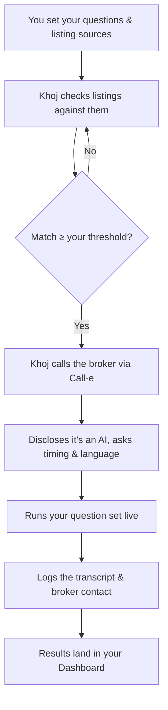

# Khoj

**Where families belong.**

Khoj is an AI voice agent that checks rental and purchase listings against the questions you actually care about — and only calls a broker when a listing already looks like a match.

Built for the [Call-e](https://call-e.devpost.com/) hackathon, using Call-e's voice-calling infrastructure.

---

## Demo

> 🎥 *Video walkthrough coming soon.*

---

## Why Khoj

Finding a home in an Indian metro usually means dozens of phone calls — half the listings are already gone, the quoted rent never matches what's advertised, and the brokerage fee only comes up at the end. Someone has to make those calls to find out what's actually true. Khoj makes them for you.

You tell Khoj what matters — rent, deposit, food policy, move-in date, anything else. It checks that against each listing before it ever dials, and only calls once a listing already answers enough of what you asked. The call itself discloses it's an AI, asks if it's a good time, runs your questions in whichever language the broker prefers, and hands you back a transcript plus the broker's contact — all in your dashboard.

## Features

**Marketing site**
- Editorial, premium landing page — hero, product story, how-it-works, pricing, FAQ
- Light/dark theme, fully responsive down to mobile
- Login, signup, and forgot-password flows

**Dashboard**
- **Guided onboarding** — a 10-question setup wizard (pick from presets or write your own), branching into a buy- or rent-specific bank of 5 more questions
- **Floating product tour** — a coachmark that walks a new user through each real dashboard section after setup
- **Questions** — manage your full question set: star up to 3 as required, group by category, add custom questions, set answer preferences per question
- **Sources** — toggle the default listing sources Khoj checks, or add your own
- **Results** — every call Khoj has made, sorted by match strength, with full transcripts, unanswered questions flagged, broker contact info, and an "ask Khoj about this listing" follow-up chat
- **Profile** — edit your display name and avatar

## How it works



## Architecture

This repo holds the **frontend** — a Vite + React single-page app — and, since the `backend` branch merged, the **API server** described under [Backend](#backend) below. The two are still being separated into independent packages; until that lands, the `src/` tree below describes the frontend only.

Every piece of dashboard data (the question bank, listing sources, call results, onboarding content) lives in `src/data/*.js` as plain static exports, deliberately kept separate from the components that use them. That's so the real backend can drop in behind the same shape later without the UI needing a rewrite — swap the file, not the app.

```
src/
├─ pages/            Route-level pages (Home, Pricing, Login, Signup, Dashboard, Terms, Privacy…)
├─ components/
│  ├─ sections/      Homepage sections (Hero, About, HowItWorks, FAQ, Creators…)
│  ├─ layout/        Navbar, Footer, AuthLayout
│  ├─ dashboard/     Dashboard shell, panels, onboarding wizard, guided tour
│  └─ ui/            Reusable primitives (Button, Input, ThemeToggle…)
├─ data/             Static/mock data — the part a real backend replaces
├─ theme/            Design tokens + light/dark theme context
└─ assets/           Images
```

## Tech stack

| | |
|---|---|
| Framework | React 19 + Vite |
| Routing | React Router 7 |
| Styling | styled-components |
| Motion | Framer Motion |
| Linting | oxlint |
| Persistence (demo) | `localStorage` — theme, onboarding answers, question set |

## Getting started

```bash
npm install
npm run dev       # start the dev server
npm run build     # production build
npm run lint      # run oxlint
```

## Deployment

Frontend and backend are deployed separately, as two independent services:

- **Frontend** (this app) → a static host like **Vercel** or **Netlify**, pointed at the `main` branch.
- **Backend** (Call-e integration, once built) → a service host that supports long-running processes, like **Render**, **Railway**, or **Fly.io** — not Vercel/Netlify, since those are built for serverless/static, not a persistent API handling live calls.

`frontend` and `backend` branches merge into `main`; `main` is what each host deploys from. The frontend talks to the backend over an API URL set as an environment variable, and the backend allows that frontend origin via CORS.

## Backend

A Node + Fastify service that places the calls, reads the transcripts, and returns
the ranked table. It runs end-to-end **today** with no telephony account and no
call credits: the dialer is an interface with a mock implementation that replays
fixture transcripts through the real webhook route.

### Test it

Nothing here needs a telephony account. Only the last two need an API key.

```bash
cp .env.example .env
npm test          # 47 tests: 39 unit + 8 integration. No key, no server.
```

```bash
npm start         # terminal 1
npm run demo      # terminal 2 — dials 12 fixture listings, prints the table
```

With `ANTHROPIC_API_KEY` set in `.env`:

```bash
npm run replay    # re-extract every stored transcript, places no calls
npm run eval      # field-level accuracy against eval/goldens.json
```

`npm run replay` is the extraction dev loop — dial once with the mock, then
iterate on the prompt against the same transcripts for free. `npm run eval`
prints exact/miss/wrong per field and exits non-zero below the 90% gate.

Other commands: `npm run reset` (wipe the local database — stop the server
first), `npm run typecheck`.

### API

```
POST /api/auth/google           verify a Google ID token, start a session
GET  /api/auth/me               current user
POST /api/auth/logout
GET  /api/auth/config           client id + whether auth is enforced
POST /api/sources/fetch         read listing pages you supply -> listings
POST /api/listings/parse        pasted text -> listings
POST /api/runs                  create a run
GET  /api/runs/:id              ranked rows + run stats
GET  /api/runs/:id/events       SSE, replays backlog via Last-Event-ID
POST /api/runs/:id/pause        kill switch, cancels in-flight calls
POST /api/runs/:id/resume
GET  /api/runs/:id/export.csv
GET  /api/calls/:id             transcript + evidence
POST /api/calls/:id/reextract   re-extract one call, no dialling
POST /api/webhooks/dialer       provider callbacks, signature-verified
GET  /api/health                reports which dialer is active
```

A Postman collection with 13 requests and assertions is in `postman/`. Run the
server with `DIALER=manual` first — that parks each call in `dialing` until you
deliver the webhook yourself, which is the only way to hand-test the provider
callback.

### State

| Piece | State |
|---|---|
| Schema, run creation, phone normalisation, dedupe, caps | done |
| Pasted-text listing parser | done (numbers deterministic; details need a key) |
| Orchestrator: concurrency, retries, window gate, resume | done |
| Mock + manual dialers over the real webhook route | done |
| SSE with `Last-Event-ID` backlog replay | done |
| Ranking, verdicts, run stats, CSV export | done |
| Guardrails + boot-time compliance assertion | done |
| Unit tests (39) + integration tests (8) | done |
| Extraction + evidence guard | written and unit-tested; **the live API call is still unverified** |
| Eval harness + goldens | done, needs a key to run |
| Call-e dialer | written against the published API 0.6.0 contract; **never run live** |
| Sign in with Google | done (ID-token verification, sessions, per-user runs) |
| Source fetching from listing URLs | done — but portals gate their numbers, see below |
| Authenticity assessment | done, and demonstrable offline |

One thing blocks the rest: a CALL-E account. Set `CALLE_API_KEY`, point
`PUBLIC_URL` at an https tunnel or host, and flip `DIALER=calle`. Nothing else
changes.

**An Anthropic key is now optional.** CALL-E extracts the fields itself from the
`recipient_result_schema` we send it, so the live path needs no LLM of our own.
`ANTHROPIC_API_KEY` is only used when a dialer returns no structured result, and
for the enrichment half of `POST /api/listings/parse`.

### Why it is built this way

**Sign-in is Google's problem, not ours.** The browser completes Google
sign-in; this server verifies the resulting ID token against Google's published
keys and mints its own session. No password ever reaches us, so there is nothing
to leak and no forgot-password flow to build. Sessions are stored hashed. Auth is
off by default (`AUTH_REQUIRED=0`) so the demo and tests keep working; turning it
on makes runs private to the user who created them, and a request for someone
else's run gets 404 rather than 403 — a stranger should not learn the id exists.

**Source fetching reads pages you point it at. It is not a crawler.** It follows
no links, and it refuses private-network addresses so a URL cannot make the
server fetch its own internals. Be realistic about reach: NoBroker, 99acres,
MagicBricks and Housing all keep broker numbers behind a login and an OTP, and
block automated readers. Those hosts return `gated` or `blocked` with an
explanation rather than a silent empty result. Where it works is everything else
— a builder's own site, a classifieds page, an exported chat.

**The authenticity score does not verify that a flat exists.** Nothing can, over
the phone. It scores how well the broker's own answers hold together: a rent far
above the advert, a pivot to a different property, no concrete viewing time,
answers that thin out when specifics are asked for. Every signal carries the
broker's own words. A broker willing to lie to a person will lie to the agent
too — what does not survive contact is the *shape* of a bait listing.

**Phone numbers are never produced by a model.** `POST /api/listings/parse` takes
whatever the seeker copied — a portal page, a WhatsApp forward, her own notes —
and finds the numbers with a deterministic scan. The model only attaches rent and
locality to numbers already in the text. A hallucinated field is a blank cell; a
hallucinated phone number is a call to a stranger.

**Every extracted field carries the words it came from.** The model must return a
verbatim quote per field, and a quote that is not literally in the transcript is
discarded and the field stays null. That is a programmatic check, not a prompt
instruction. The stored evidence also carries audio offsets, which is what makes
click-a-cell-and-hear-the-broker possible.

**`fieldsPresent` (0–5), not a confidence score.** A model's self-reported
confidence is uncalibrated and should not gate the UI. A count of how many fields
came back non-null is checkable and cannot be invented.

**A call slot is held until the call ends, not until it is placed.** Placing a
call returns in milliseconds while the call itself runs for a minute — releasing
on that resolution let the whole list dial at once and made the concurrency cap
decorative. The webhook frees the line.

**The opener discloses the AI and asks to record.** A boot-time assertion refuses
to start the server if either sentence is edited away, or if promotional language
creeps into the script. Consent is stored per call, so the demo video can be
filtered to consenting calls only.

**Calls only go out 11:00–13:00 and 17:00–20:00 IST**, one call per number per
seven days, capped at 40 listings a run, with a kill switch that cancels
in-flight calls. See `.env.example` for the knobs.

## Team

- **[Ishika Dumeer](https://github.com/Ishika1106)** — [LinkedIn](https://www.linkedin.com/in/ishika-dumeer/)
- **[Manyam Harshitha Reddy](https://github.com/manyamharshitha)** — [LinkedIn](https://www.linkedin.com/in/harshitha-manyam-9868a9379/)
