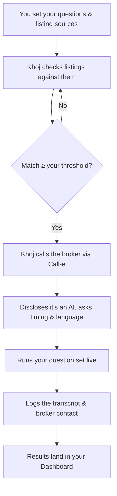

# Khoj

**Where families belong.**

Khoj is an AI voice agent that checks rental and purchase listings against the questions you actually care about — and only calls a broker when a listing already looks like a match.

Built for the [Call-e](https://call-e.devpost.com/) hackathon, using Call-e's voice-calling infrastructure.

---

## Demo

> 🎥 *Video walkthrough coming soon.*

---

## Why Khoj

Finding a home in an Indian metro usually means dozens of phone calls — half the listings are already gone, the quoted rent never matches what's advertised, and the brokerage fee only comes up at the end. Someone has to make those calls to find out what's actually true. Khoj makes them for you.

You tell Khoj what matters — rent, deposit, food policy, move-in date, anything else. It checks that against each listing before it ever dials, and only calls once a listing already answers enough of what you asked. The call itself discloses it's an AI, asks if it's a good time, runs your questions in whichever language the broker prefers, and hands you back a transcript plus the broker's contact — all in your dashboard.

## Features

**Marketing site**
- Editorial, premium landing page — hero, product story, how-it-works, pricing, FAQ
- Light/dark theme, fully responsive down to mobile
- Login, signup, and forgot-password flows

**Dashboard**
- **Guided onboarding** — a 10-question setup wizard (pick from presets or write your own), branching into a buy- or rent-specific bank of 5 more questions
- **Floating product tour** — a coachmark that walks a new user through each real dashboard section after setup
- **Questions** — manage your full question set: star up to 3 as required, group by category, add custom questions, set answer preferences per question
- **Sources** — toggle the default listing sources Khoj checks, or add your own
- **Results** — every call Khoj has made, sorted by match strength, with full transcripts, unanswered questions flagged, broker contact info, and an "ask Khoj about this listing" follow-up chat
- **Profile** — edit your display name and avatar

## How it works



## Architecture

This repo currently holds the **frontend only** — a Vite + React single-page app. There is no backend yet; the Call-e voice-calling integration is being built separately.

Every piece of dashboard data (the question bank, listing sources, call results, onboarding content) lives in `src/data/*.js` as plain static exports, deliberately kept separate from the components that use them. That's so the real backend can drop in behind the same shape later without the UI needing a rewrite — swap the file, not the app.

```
src/
├─ pages/            Route-level pages (Home, Pricing, Login, Signup, Dashboard, Terms, Privacy…)
├─ components/
│  ├─ sections/      Homepage sections (Hero, About, HowItWorks, FAQ, Creators…)
│  ├─ layout/        Navbar, Footer, AuthLayout
│  ├─ dashboard/     Dashboard shell, panels, onboarding wizard, guided tour
│  └─ ui/            Reusable primitives (Button, Input, ThemeToggle…)
├─ data/             Static/mock data — the part a real backend replaces
├─ theme/            Design tokens + light/dark theme context
└─ assets/           Images
```

## Tech stack

| | |
|---|---|
| Framework | React 19 + Vite |
| Routing | React Router 7 |
| Styling | styled-components |
| Motion | Framer Motion |
| Linting | oxlint |
| Persistence (demo) | `localStorage` — theme, onboarding answers, question set |

## Getting started

```bash
npm install
npm run dev       # start the dev server
npm run build     # production build
npm run lint      # run oxlint
```

## Deployment

Frontend and backend are deployed separately, as two independent services:

- **Frontend** (this app) → a static host like **Vercel** or **Netlify**, pointed at the `main` branch.
- **Backend** (Call-e integration, once built) → a service host that supports long-running processes, like **Render**, **Railway**, or **Fly.io** — not Vercel/Netlify, since those are built for serverless/static, not a persistent API handling live calls.

`frontend` and `backend` branches merge into `main`; `main` is what each host deploys from. The frontend talks to the backend over an API URL set as an environment variable, and the backend allows that frontend origin via CORS.

## Team

- **[Ishika Dumeer](https://github.com/Ishika1106)** — [LinkedIn](https://www.linkedin.com/in/ishika-dumeer/)
- **[Manyam Harshitha Reddy](https://github.com/manyamharshitha)** — [LinkedIn](https://www.linkedin.com/in/harshitha-manyam-9868a9379/)
