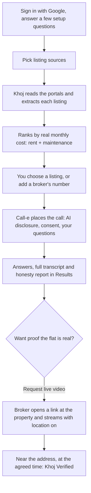

<div align="center">


[](https://react.dev)
[](https://vitejs.dev)
[](https://fastapi.tiangolo.com)
[](https://firebase.google.com)
[](https://ai.google.dev)
[](https://livekit.io)
[](https://call-e.devpost.com/)
[](#why-khoj)

**Khoj finds rental listings across Indian portals, has an AI voice agent call the broker to check what the advert left out, and can ask that broker for a live video from the property before you ever visit.**

Built for the [Call-e](https://call-e.devpost.com/) hackathon, on Call-e's voice-calling infrastructure. Call-e is an international challenge; Khoj is our answer to a distinctly Indian problem.

**[Live site](https://khoj-beta.vercel.app)** · **[Demo video](#demo)** · **[Call-e integration notes](#call-e-integration-notes)** · **[How to test](#how-to-test)**

</div>

---

## Demo

**Live:** [khoj-beta.vercel.app](https://khoj-beta.vercel.app)

**Video:** *link added once uploaded*

---

## Why Khoj

Finding a home in an Indian city is an ordeal fought almost entirely over the phone. Listings go stale the moment they're posted. A good share of what's live on the big portals turns out to be already rented, already sold, or already someone else's problem. The number quoted on a call rarely matches the number in the advert. The brokerage fee — often a full month's rent — only surfaces once you've already fallen for the place. And every one of these truths is gated behind a broker's phone number.

Someone has to make those calls to find out what's actually true. Khoj makes them for you.

You tell Khoj what matters — budget, bedrooms, locality, food policy, move-in date, anything else that keeps you up at night. It reads listings from your sources, ranks them by what you would truly pay each month — rent and maintenance together, never just the number the portal chose to lead with — and calls only the ones you pick. The call opens honestly: it says it's an AI, asks consent to record, then runs your questions, switching to Hindi, Telugu, Kannada, Tamil or Marathi if that's what the broker speaks. Because a phone call is not proof that a flat exists, Khoj checks what was said against what was advertised and flags every point where the two disagree. The answers, the full transcript and that honesty report land in your dashboard. And when you want proof the flat is real, Khoj can ask the broker for a **live video from the property, with their location on** — the only way to earn the **Khoj Verified** badge.

Every call runs only inside TRAI-friendly windows, never touches the same number twice in a week, and is built to never negotiate, never book a viewing, and never let slip your budget — because the distance between *useful* and *unwanted robocaller* is exactly these three restraints, and this is a country with a long, well-earned memory for the latter.

### Why the name

**Khoj** (खोज) is Hindi for *search* — but a particular kind of search. Not the idle scroll through a listings page, but the deliberate kind: a hunt, an inquiry, a quest for what is real rather than what is merely posted. That is the entire product folded into one word — you were never looking for a webpage. You were looking for somewhere someone will actually let you live. Khoj goes and finds out if they will.

---

## How it works



---

## Features

**For people looking for a home**
- **Guided setup** — a short questionnaire (city, locality, budget, bedrooms, move-in, and more) that becomes both the search and the questions asked on the call
- **Sources** — NoBroker, RealEstateIndia, Zolo, Colive and Khoj's own listings, switchable one by one, plus any listing site you paste in. Portals that refuse automated readers (99acres, MagicBricks, Housing, OLX) are left out rather than shown as broken
- **Results** — every listing with its photo, rent, size and a link back to the page it came from, ranked by total monthly cost
- **Verification calls** — placed only after an explicit confirmation that names the property and warns it rings a real person
- **Call transcripts** — every completed call shows the broker's answers and the whole conversation, turn by turn
- **Honesty report** — what the broker said, checked against the advert, with a "likely genuine" score and every mismatch quoted
- **Ask Khoj about this listing** — answers from the transcript, the advert and the honesty report; if the call didn't cover it, it says so instead of guessing
- **Live video verification** — request a live stream from the broker at an agreed time; the phone's GPS is checked against the property address, and a location mismatch is shown with its distance and a manual override rather than an automatic fail
- **Security deposit negotiation** — the AI drafts offers, you pick, edit and send them, and every offer from either side is kept
- **Call history** — every call you have ever placed, across searches
- **Notifications**, light and dark themes, and a fully responsive layout

**For brokers**
- **Broker dashboard** — your own listings and the enquiries and verification requests that reach you

**Plans** — Free, Silver, Gold and Premium, differing in how many verifications you can run.

**Pipeline** (backend)
- **Page reading** — a plain HTTP reader first, with headless Chromium only as a fallback and only when the host has the memory for it
- **Extraction** — listings turned into typed, comparable data by an LLM
- **Deterministic ranking** — total monthly outflow ascending, newer buildings on ties; listings with unknown cost sort last, never first
- **Compliant calling** — the AI disclosure and consent request are checked at startup and the call refuses to run without them; TRAI-friendly windows; a 7-day per-number cooldown
- **Honesty scoring** — every discrepancy is quoted from the transcript, never invented

---

## Tech stack

**Frontend**

| | |
|---|---|
| Framework | React 19 + Vite 8 |
| Routing | React Router 7 |
| Styling | styled-components, with a light/dark design-token theme |
| Typography | Fraunces (display serif), Inter (UI), IBM Plex Mono (data) |
| Motion & 3D | Framer Motion · React Three Fiber / drei · cobe (interactive globe) |
| Auth | Firebase Authentication (email + Google) |
| Live video | livekit-client |
| Hosting | Vercel |

**Backend**

| | |
|---|---|
| Framework | FastAPI (Python 3.11+), Pydantic v2 |
| Data | Firestore Enterprise through its MongoDB-compatible API (Motor); firebase-admin verifies Google sign-in tokens |
| Voice calling | Call-e (`calle-ai` SDK) |
| LLM | Gemini or OpenAI, behind one structured-JSON interface |
| Live video | LiveKit — tokens, rooms and signed webhooks |
| Messaging | Twilio SMS / WhatsApp, with a `wa.me` hand-off when no sender is configured |
| Scraping | httpx page reader, Playwright Chromium fallback |
| Tests | pytest: 271 offline tests, plus 14 live tests against LiveKit and the database |
| Hosting | Render |

---

## Call-e integration notes

**What a call does.** For each listing, Khoj builds one natural-language task from a fixed persona plus the customer's own questions, and hands it to Call-e with `create_and_wait`. The task tells the agent to disclose that it is an AI, ask consent to record, ask the questions, and read numbers back. Call-e returns the transcript and a structured result; Khoj maps those onto answers, a transcript, and an honesty check against the advert. See `backend-py/app/telephony/persona.py` and `backend-py/app/telephony/calle_dialer.py`.

**Setup.** Set `CALLE_API_KEY` in `backend-py/.env`, and optionally `CALL_REGION` and `CALL_LOCALE` (default `en-IN`). `GET /api/health` reports `calle_configured`.

**Usage.** A call starts only from an explicit action, never from a search on its own:
- **Results → Verify by phone → Yes, call now**
- **Sources → Already have a number? → Add this listing → Call now**

**Side effects.** Each call rings a real person and uses one of the account's verifications. The confirmation dialog says both before anything is dialled.

**Safety.**
- The opener must disclose the AI and ask consent; the call script refuses to build if either has been removed. If consent is refused, the call ends there.
- The agent never states the customer's budget, never makes an offer, never negotiates, and never books a viewing.
- Calls run only between 11:00–13:00 and 17:00–20:00 IST.
- The same number is not called again within 7 days.
- Only a few calls run at once.
- Phone numbers are masked on result cards.

**Cancellation.** There is no recurring schedule: each call is placed once, on confirmation. A call already in progress is not cancellable from the dashboard; the broker can hang up at any time, and declining consent ends it immediately.

---

## How to test

1. Open **[khoj-beta.vercel.app](https://khoj-beta.vercel.app)** and sign in with Google.
2. Answer the setup questions (city **Bengaluru**, locality **Koramangala** gives plenty of listings).
3. **Sources → Search Properties From Selected Sources.** Please search once: the AI extraction runs on a free tier with a small daily quota shared by everyone testing.
4. **Results** — browse listings, open one, follow the link to its portal.
5. To try a call, use **your own phone number**: **Sources → Already have a number? → Add this listing → Call now**, then answer the phone.
   - Calls only go out **11:00–13:00 and 17:00–20:00 IST**. Outside those hours nothing is dialled, and the listing says so.
   - A number called in the last 7 days is blocked, so use a number that hasn't been used.
6. When the call completes, open the card: the answers, **Read the full call**, and **Request live video**.
7. **Verified → Send the request now.** Text messages aren't configured on the live deployment, so this offers **Send on WhatsApp** with the message ready to send.

The first request after the server has been idle can take up to a minute while it wakes up.

---

## Known limits

- **No call audio.** Call-e returns transcripts, not recordings, so Khoj shows the conversation as text.
- **Location checks need an address.** A listing added by phone number alone has no address to compare the phone's GPS against, so its live video is marked *received*, not *verified*.
- **Messages go through WhatsApp for now.** The Twilio account is on a trial that can't send free text to arbitrary numbers.
- **Some portals can't be searched.** 99acres, MagicBricks, Housing and OLX refuse automated readers.
- **Free-tier AI quota.** Many searches in one day can exhaust it.

---

## Getting started

**Frontend**
```bash
cd frontend
npm install
cp env.example .env.local   # Firebase web config and VITE_API_BASE_URL (your backend's URL)
npm run dev
```

**Backend**
```bash
cd backend-py
python -m venv .venv && source .venv/bin/activate   # Windows: .venv\Scripts\activate
pip install -r requirements.txt
python -m playwright install chromium
cp .env.example .env                                # database, Call-e, Gemini, LiveKit keys
uvicorn app.main:app --reload --port 8000
```

**Tests**
```bash
cd backend-py
python -m pytest -q            # offline suite
python -m pytest -q -m live    # needs LiveKit keys, the database, and the backend running
```

---

## Team

**Team Khoj**

- **Ishika Dumeer**
- **Manyam Harshitha**

<div align="center">


*Khoj — for the ones still looking.*

</div>
