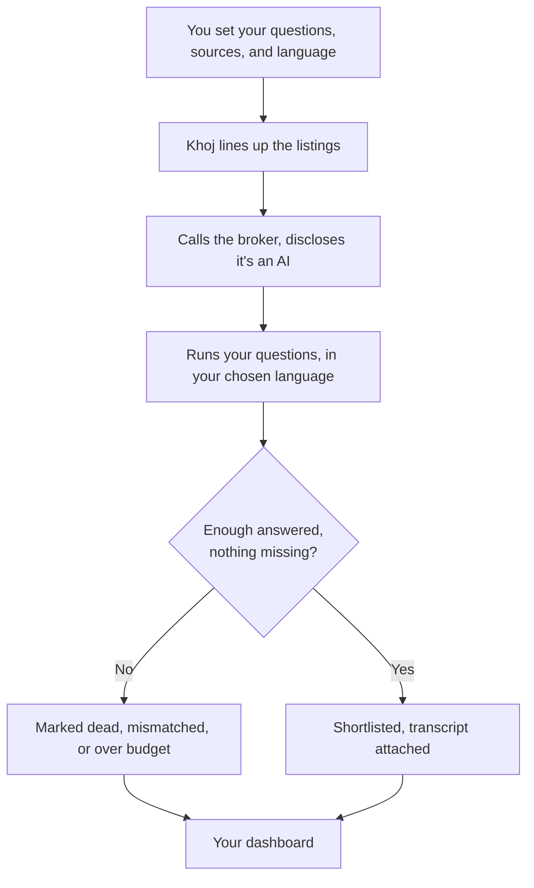
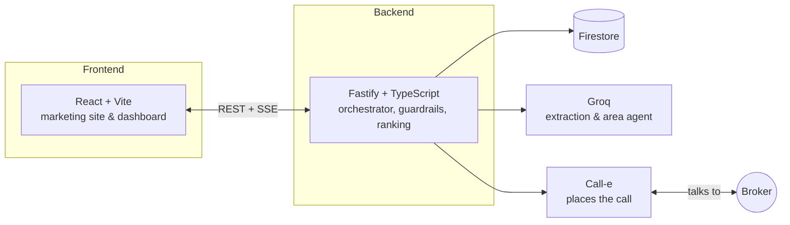

# KHOJ

*खोज — to search, to seek, to find.*

Every house hunt in an Indian city runs on the same ritual: call the broker, ask the same six questions, get told the flat is "available," show up, find out it isn't. Khoj makes those calls so you don't have to — and it only makes them for listings worth the trouble.

## Why Khoj

A listing photo tells you nothing. A phone call tells you everything — the real rent, whether the deposit quietly doubled, whether "family only" bends for the right tenant, whether the flat exists at all. Someone has to have that conversation. Khoj has it, in the language the broker is comfortable in, and hands you back not a guess but a transcript.

## What it does

- **Asks you first.** Ten questions to start, five more if you want them, three you can mark non-negotiable.
- **Chooses its own sources.** Our defaults, or listing pages you point it at yourself.
- **Calls, and says so.** Every conversation opens with the truth — an AI, calling on your behalf, recording with consent — then runs your questions in English, Hindi, or Telugu.
- **Scores what it hears.** A listing earns a place on your shortlist only once enough of your questions come back answered, and never if a must-have doesn't.
- **Answers what a call can't.** A Groq-backed agent reads the neighbourhood's own reviews and forums for the questions a broker won't know — and hands you the broker's number when the internet comes up empty.

## How it works



## Architecture



Two independent services, one repository:

```
frontend/    the site and dashboard you see
backend/     the API that does the calling
```

Each deploys on its own — the frontend to a static host, the backend to anything that keeps a process alive, since a live call needs somewhere to come back to.

## Tech stack

| | Frontend | Backend |
|---|---|---|
| Runtime | React 19 + Vite | Node + Fastify (TypeScript) |
| Routing | React Router 7 | REST + Server-Sent Events |
| Styling | styled-components, Framer Motion | — |
| Data | Firebase Auth | Firestore, Firebase Admin |
| Intelligence | — | Groq (extraction, area agent) |
| Voice | — | Call-e |

## Fork it

```bash
git clone https://github.com/manyamharshitha/KHOJ.git
cd KHOJ

cd frontend && npm install && npm run dev    # the site, on :5173
cd ../backend && npm install                 # the API

cp .env.example .env   # fill in Firebase, Groq, and Call-e credentials
npm start                                    # the API, on :8080
```

Nothing in this repository holds a real credential — every key lives in an `.env` you provide. Fill it in, and the whole thing is yours.

## Team

- **[Ishika Dumeer](https://github.com/Ishika1106)** — [LinkedIn](https://www.linkedin.com/in/ishika-dumeer/)
- **[Manyam Harshitha Reddy](https://github.com/manyamharshitha)** — [LinkedIn](https://www.linkedin.com/in/harshitha-manyam-9868a9379/)
