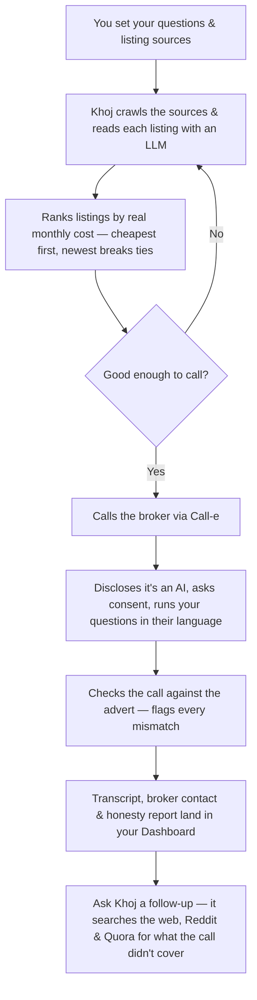

<div align="center">


[](https://react.dev)
[](https://vitejs.dev)
[](https://fastapi.tiangolo.com)
[](https://firebase.google.com)
[](https://ai.google.dev)
[](https://call-e.devpost.com/)
[](#why-khoj)

**Khoj is an AI voice agent that checks rental and purchase listings against the questions you actually care about — and only calls a broker once a listing already looks like a match.**

Built for the [Call-e](https://call-e.devpost.com/) hackathon, on Call-e's voice-calling infrastructure. Call-e is an international challenge; Khoj is our answer to a distinctly Indian problem.

</div>

---

## Demo

*Video walkthrough coming soon.*

---

## Why Khoj

Finding a home in an Indian city is a ordeal fought almost entirely over the phone. Listings go stale the moment they're posted. Half of what's live on NoBroker, 99acres, MagicBricks, Housing, and OLX turns out to be already rented, already sold, or already someone else's problem. The number quoted on a call rarely matches the number in the advert. The brokerage fee — often a full month's rent — only surfaces once you've already fallen for the place. And every single one of these truths is gated behind a broker's phone number, answered in whichever language they happen to be most comfortable in: Hindi, Tamil, Telugu, Bengali, or the particular English of a WhatsApp forward.

Someone has to make those calls to find out what's actually true. Khoj makes them for you.

You tell Khoj what matters — rent, deposit, food policy, move-in date, anything else that keeps you up at night. It reads every listing across your sources the way a patient, unhurried person would, ranks them by what you would truly pay each month — rent and maintenance together, never just the number the portal chose to lead with — and dials only once a listing has already earned the call. The conversation opens honestly: it discloses that it's an AI, asks consent to record, and then runs your question set live, in whichever language the broker is most at ease in. Because a phone call is not proof that a flat exists, Khoj checks what was said against what was advertised, and flags every point where the two disagree. The transcript, the broker's contact, and that honesty report all land in your dashboard, waiting for you. And if something still isn't covered — *does this street flood in the monsoon?* — you can ask Khoj directly from the listing, and it goes looking through the web, Reddit, and Quora for something closer to an answer than a shrug.

Every call runs only inside TRAI-friendly windows, never touches the same number twice in a week, and is built to never negotiate, never book a viewing, and never let slip your budget — because the distance between *useful* and *unwanted robocaller* is exactly these three restraints, and this is a country with a long, well-earned memory for the latter.

### Why the name

**Khoj** (खोज) is Hindi for *search* — but a particular kind of search. Not the idle scroll through a listings page, but the deliberate kind: a hunt, an inquiry, a quest for what is real rather than what is merely posted. It's the word you reach for when you're looking for something specific and refuse to stop at the first plausible answer. That is the entire product folded into one word — you were never looking for a webpage. You were looking for somewhere someone will actually let you live. Khoj goes and finds out if they will.

---

## How it works



---

## Features

**Marketing site**
- Editorial, premium landing page — hero, product story, how-it-works, pricing, FAQ
- Light and dark themes, fully responsive down to mobile
- Login, signup, and forgot-password flows, backed by real Firebase Authentication

**Dashboard**
- **Guided onboarding** — a ten-question setup wizard (pick from presets or write your own), branching into a buy- or rent-specific bank of five more questions
- **Floating product tour** — a coachmark that walks a new user through each real dashboard section after setup
- **Questions** — manage your full question set: star up to three as required, group by category, add custom questions, set an answer preference per question
- **Sources** — toggle the default listing sources Khoj checks, or add your own
- **Results** — every call Khoj has made, sorted by match strength, with full transcripts, unanswered questions flagged, broker contact info, and an *"ask Khoj about this listing"* follow-up chat that pulls in outside sources when the call didn't cover it
- **Profile** — edit your display name and avatar

**Voice & intelligence pipeline** (backend)
- **Preference parsing** — free-text requirements become a structured search brief, no keyword rules
- **Crawl & extract** — listings are read from each source and turned into typed, comparable data by an LLM
- **Deterministic ranking** — sorted by actual monthly outflow, never by whatever number the portal leads with
- **Compliant calling** — every call discloses it's an AI, asks consent to record, and runs only in TRAI-friendly windows; a call with no clear consent is discarded, not stored
- **Honesty scoring** — the transcript is checked against the advert, and every discrepancy is quoted, never invented
- **Area intelligence chat** — follow-up questions are answered from public sources with citations, not guesses

---

## Tech stack

**Frontend**

| | |
|---|---|
| Framework | React 19 + Vite |
| Routing | React Router 7 |
| Styling | styled-components, with a light/dark design-token theme |
| Typography | Fraunces (display serif), Inter (UI), IBM Plex Mono (data) |
| Motion & 3D | Framer Motion · React Three Fiber / drei · cobe (interactive globe) |
| Auth | Firebase Authentication (email + Google) |
| Linting | oxlint |

**Backend**

| | |
|---|---|
| Framework | FastAPI (Python 3.11+) |
| Data | Firebase — Firestore (documents) + Storage (call recordings) |
| LLM | Gemini or OpenAI, provider-agnostic behind one structured-JSON interface |
| Voice calling | Call-e |
| Scraping | Playwright-driven crawler over NoBroker, 99acres, MagicBricks, Housing, OLX & custom URLs |
| Reliability | tenacity (retries), Pydantic v2 (schema everywhere), pytest |

---

## Getting started

**Frontend**
```bash
npm install
npm run dev       # start the dev server
npm run build     # production build
npm run lint      # run oxlint
```

**Backend**
```bash
cd backend-py
python -m venv .venv && source .venv/bin/activate   # Windows: .venv\Scripts\activate
pip install -e ".[dev]"
cp .env.example .env
uvicorn app.main:app --reload --port 8000
```

---

## Team

- **Ishika Dumeer**
- **Harshitha**

<div align="center">


*Khoj — for the ones still looking.*

</div>
